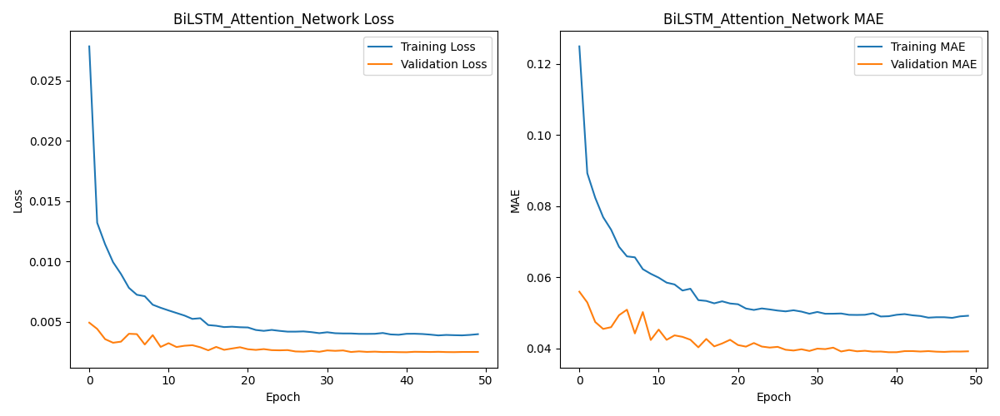
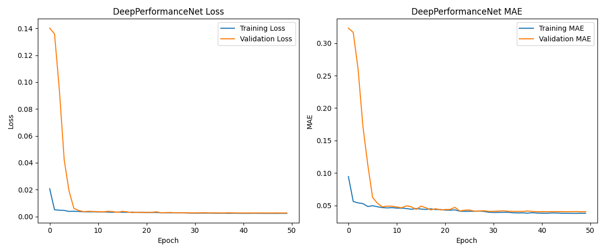
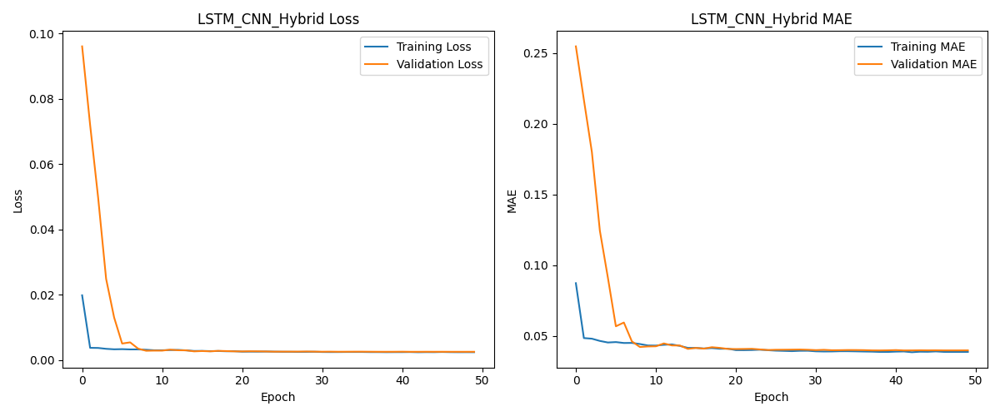
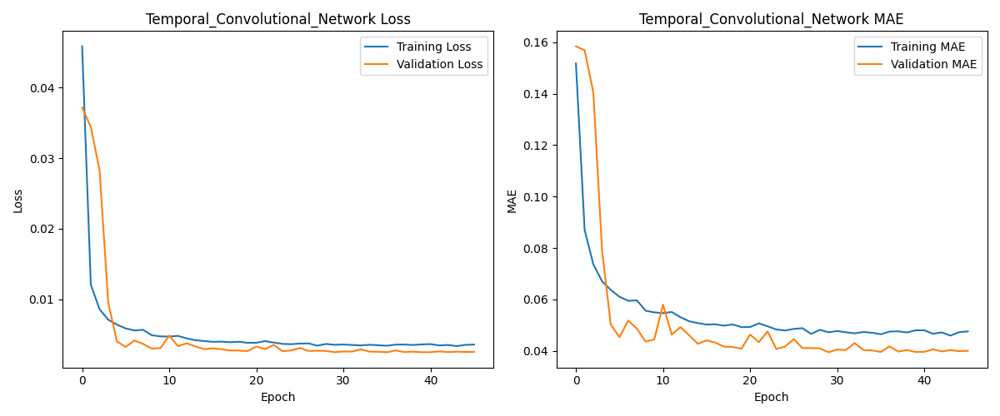

# Predictive Cloud Optimizer

An end-to-end deep learning system that forecasts Virtual Machine (VM) resource usage—CPU, Memory, and Network Traffic—for the next hour using historical cloud performance data. This project evaluates multiple model architectures and helps in dynamic resource allocation to reduce costs and prevent service failures.

---

## 📊 Project Overview

* **Goal**: Predict VM resource usage an hour ahead using past 24 hours of metrics.
* **Dataset**: Time-series cloud usage data from multiple VMs.
* **Models Implemented**:

  * LSTM-CNN Hybrid
  * Temporal Convolutional Network (TCN)
  * BiLSTM with Attention
  * DeepPerformanceNet (GRU + Residual CNN)
* **Metrics**: Mean Absolute Error (MAE), Model Size, Convergence Epochs
* **Tech Stack**: Python, TensorFlow/Keras, Pandas, Matplotlib

---

## 📂 Directory Structure

```
Predictive-Cloud-Optimizer/
├── data/
│   ├── vmcloud_performance.csv         # Full dataset
│   └── vm_24h.csv                      # Sample 24-hour VM input for prediction
├── models/                             # Trained model files & training plots
├── model_analysis/                     # Metrics CSVs and comparison graphs
├── main.py                             # Full training pipeline
├── predict.py                          # Inference script
├── requirements.txt
└── README.md
```

---

## ⚙️ How to Use

### 1. Installation

Clone the repository to your local machine:

```bash
git clone https://github.com/dhillonharjot/Predictive-Cloud-Optimizer.git
cd Predictive-Cloud-Optimizer
```

### 2. Setup

```bash
pip install -r requirements.txt
```

### 3. Train Models

```bash
python main.py
```

This trains all 4 models and saves:

* Model files (.keras)
* Training graphs (Loss/MAE)
* Model comparison charts
* Metrics CSV

### 4. Predict Next Hour

#### Option A: Use Sample 24-Hour File

If you already have a 24-hour dataset:

```bash
python predict.py --input_file data\vm_24h.csv
```

#### Option B: No Input File?

If you run the script without any arguments, it will automatically find a suitable 24-hour sample from the full dataset and make a prediction.

```bash
python predict.py
```

---

## 📊 Results Snapshot

* **Best MAE**: `BiLSTM_Attention_Network`
* **Most Efficient**: `Temporal_Convolutional_Network`


| Model                          | Test MAE | Convergence (Epochs) | Model Size (Params) |
| ------------------------------ | -------- | -------------------- | ------------------- |
| **BiLSTM_Attention_Network** | 0.0389   | 41                   | 78,659              |
| Temporal_Convolutional_Network | 0.0395   | 36                   | 54,499              |
| LSTM_CNN_Hybrid                | 0.0396   | 43                   | 72,867              |
| DeepPerformanceNet             | 0.0402   | 49                   | 92,355              |

---

## 🔢 Sample Prediction Output

```
--- FORECAST FOR THE NEXT HOUR ---
Predicted CPU Usage:     21.25 %
Predicted Memory Usage:  24.81 %
Predicted Network Traffic: 137.61 KB/s
```

---

## 📈 Model Training Curves

### BiLSTM + Attention



### DeepPerformanceNet



### LSTM-CNN Hybrid



### Temporal Convolutional Network



---


## 📢 Acknowledgements

* Inspired by GWA Bitbrains cloud trace dataset.
* Architecture ideas adapted from research literature on time-series forecasting.

---

## 🔑 License

This project is for educational and demonstration purposes.
